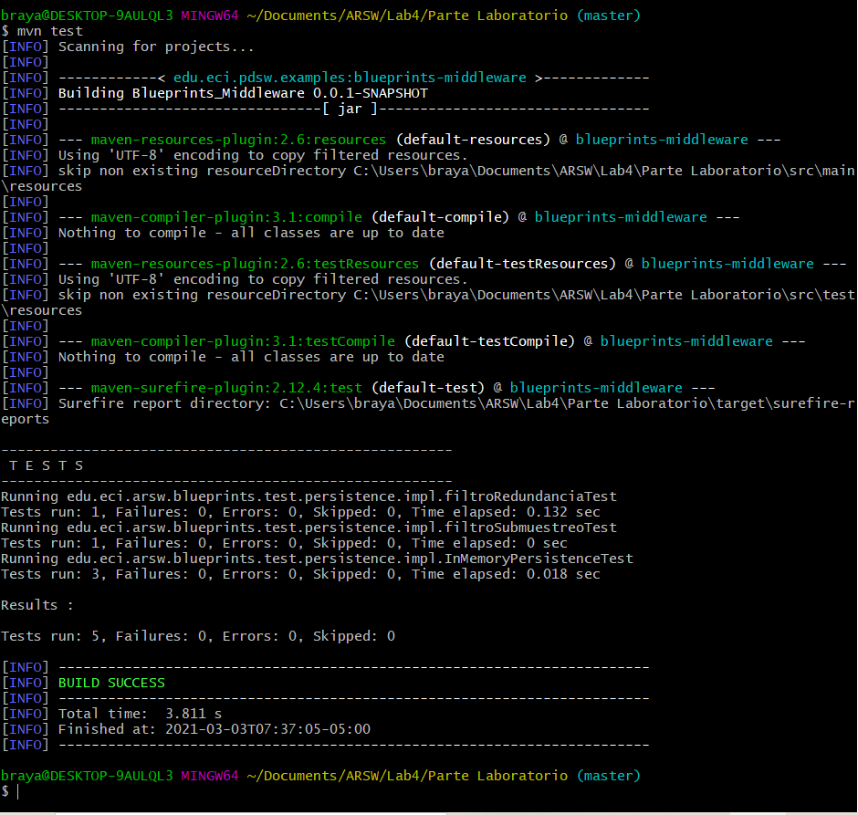

### Escuela Colombiana de Ingeniería

### Arquitecturas de Software – ARSW

## Laboratorio Componentes y conectores  Middleware- gestión de planos

### EJERCICIO
* [Ejercicio introductorio al manejo de Spring y la configuración basada en anotaciones](https://github.com/ARSW-ECI-beta/DIP_DI-SPRING_JAVA-GRAMMAR_CHECKER).

Parte I. Ejercicio básico.

Para ilustrar el uso del framework Spring, y el ambiente de desarrollo para el uso del mismo a través de Maven (y NetBeans), se hará la configuración de una aplicación de análisis de textos, que hace uso de un verificador gramatical que requiere de un corrector ortográfico. A dicho verificador gramatical se le inyectará, en tiempo de ejecución, el corrector ortográfico que se requiera (por ahora, hay dos disponibles: inglés y español).

1. Abra el los fuentes del proyecto en NetBeans.

2. Revise el archivo de configuración de Spring ya incluido en el proyecto (src/main/resources). El mismo indica que Spring buscará automáticamente los 'Beans' disponibles en el paquete indicado.

3. Haciendo uso de la [configuración de Spring basada en anotaciones](https://docs.spring.io/spring-boot/docs/current/reference/html/using-boot-spring-beans-and-dependency-injection.html) marque con las anotaciones @Autowired y @Service las dependencias que deben inyectarse, y los 'beans' candidatos a ser inyectadas -respectivamente-:

	* GrammarChecker será un bean, que tiene como dependencia algo de tipo 'SpellChecker'.
		
		```
		@Service
		public class GrammarChecker {
			@Autowired
			
			SpellChecker sc;
			String x;
				
			public SpellChecker getSpellChecker() {
				return sc;
			}

			public void setSpellChecker(SpellChecker sc) {
				this.sc = sc;
			}


			public String check(String text){
				
				StringBuffer sb=new StringBuffer();
				sb.append("Spell checking output:"+sc.checkSpell(text));
				sb.append("Plagiarism checking output: Not available yet");		
				return sb.toString();	
			}
		}
		```

	* EnglishSpellChecker y SpanishSpellChecker son los dos posibles candidatos a ser inyectados. Se debe seleccionar uno, u otro, mas NO ambos (habría conflicto de resolución de dependencias). Por ahora haga que se use EnglishSpellChecker.
	```
	public class EnglishSpellChecker implements SpellChecker {

		@Override
		public String checkSpell(String text) {		
			return "Checked with english checker:"+text;
		}

			
	}

	```
	
	```
	@Service
	public class SpanishSpellChecker implements SpellChecker {

		@Override
		public String checkSpell(String text) {
			return "revisando ("+text+") con el verificador de sintaxis del espanol";           
		}
	}
	```
 
5.	Haga un programa de prueba, donde se cree una instancia de GrammarChecker mediante Spring, y se haga uso de la misma:

	```
	public class Main{

		public static void main(String a[]) {
			instancia1();
			instancia2();
		}
		
		public static void instancia1(){
			ApplicationContext ac = new ClassPathXmlApplicationContext("applicationContext.xml");
			GrammarChecker gc = ac.getBean(GrammarChecker.class);
			System.out.println(gc.check("English language grammar check request."));
		}
		
		public static void instancia2(){
			ApplicationContext ac = new ClassPathXmlApplicationContext("applicationContext.xml");
			GrammarChecker gc = ac.getBean(GrammarChecker.class);
			System.out.println(gc.check("Solicitud de verificacion de gramatica en el idioma español"));
		}
		
	}
	```
	
	Spell checking output:Checked with english checker:Performing grammar check in Spanish. Plagiarism checking output: Not available yet
	Spell checking output:Checked with english checker:Performing second grammar check in Spanish. Plagiarism checking output: Not available yet
	
Compilacion:


Empaquetado:


Test:




### LABORATORIO
En este ejercicio se va a construír un modelo de clases para la capa lógica de una aplicación que permita gestionar planos arquitectónicos de una prestigiosa compañia de diseño. 


### Parte I.

1. Configure la aplicación para que funcione bajo un esquema de inyección de dependencias, tal como se muestra en el diagrama anterior.


	Lo anterior requiere:

	* Agregar las dependencias de Spring.
	* Agregar la configuración de Spring.
	* Configurar la aplicación -mediante anotaciones- para que el esquema de persistencia sea inyectado al momento de ser creado el bean 'BlueprintServices'.


2. Complete los operaciones getBluePrint() y getBlueprintsByAuthor(). Implemente todo lo requerido de las capas inferiores (por ahora, el esquema de persistencia disponible 'InMemoryBlueprintPersistence') agregando las pruebas correspondientes en 'InMemoryPersistenceTest'.

Realizando la respectiva implementacion de los metodos nombrados, se puede evidenciar que se realiza de la siguiente forma:

**InMemoryBlueprintPersistence**

```
@Service("InMemoryBlueprintPersistence")
public class InMemoryBlueprintPersistence implements BlueprintsPersistence{

    private final Map<Tuple<String,String>,Blueprint> blueprints=new HashMap<>();
	
	/**
	*/
    public InMemoryBlueprintPersistence() {
        //load stub data
        Point[] pts=new Point[]{new Point(140, 140),new Point(115, 115)};
        Blueprint bp=new Blueprint("_authorname_", "_bpname_ ",pts);
        blueprints.put(new Tuple<>(bp.getAuthor(),bp.getName()), bp);
        
    }    
    
	/**
	*/
	@Override
    public  HashSet<Blueprint> getAllBlueprints(){
        return new HashSet<Blueprint>(blueprints.values());
    }
	
	/**
	*/
	@Override
	public Set<Blueprint> getBlueprintsByAuthor(String author) throws BlueprintNotFoundException{
		Set<Blueprint> autorBp = new HashSet<>();
        Set<Tuple<String,String>> llaves = blueprints.keySet();
        for(Tuple<String,String> i : llaves){
            if(i.getElem1().equals(author)){
                autorBp.add(blueprints.get(i));
            }
        }
        return autorBp;
	}
	
	/**
	*/
    @Override
    public void saveBlueprint(Blueprint bp) throws BlueprintPersistenceException {
        if (blueprints.containsKey(new Tuple<>(bp.getAuthor(),bp.getName()))){
            throw new BlueprintPersistenceException("The given blueprint already exists: "+bp);
        }
        else{
            blueprints.put(new Tuple<>(bp.getAuthor(),bp.getName()), bp);
        }        
    }
	
	/**
	*/
    @Override
    public Blueprint getBlueprint(String author, String bprintname) throws BlueprintNotFoundException {
        return blueprints.get(new Tuple<>(author, bprintname));
    }
}
```

**InMemoryBlueprintPersistenceTest**

```
public class InMemoryPersistenceTest {
    
	@Test
	public void getBlueprintsByAuthorTest(){
		InMemoryBlueprintPersistence ibpp=new InMemoryBlueprintPersistence();
        Point[] pts0=new Point[]{new Point(20, 20),new Point(10, 10)};
        Blueprint bp0=new Blueprint("mack","mypaint",pts0);
        Point[] pts1=new Point[]{new Point(0, 0),new Point(15, 15)};
        Blueprint bp1=new Blueprint("john", "thepaint",pts1);
        Point[] pts2=new Point[]{new Point(0, 0),new Point(15, 15)};
        Blueprint bp2=new Blueprint("mack", "thepaint1",pts2);
        Point[] pts3=new Point[]{new Point(0, 0),new Point(15, 15)};
        Blueprint bp3=new Blueprint("john", "thepaint1",pts3);
        Set<Blueprint> respuesta= null;
        try {
            ibpp.saveBlueprint(bp0);
            ibpp.saveBlueprint(bp1);
            ibpp.saveBlueprint(bp2);
            ibpp.saveBlueprint(bp3);
        } catch (BlueprintPersistenceException e) {
            e.printStackTrace();
        }
        Set<Blueprint> aux = new HashSet<>();
        aux.add(bp0);
        aux.add(bp2);
        try {
           respuesta = ibpp.getBlueprintsByAuthor("mack");
        } catch (BlueprintNotFoundException e) {
            e.printStackTrace();
        }
        assertEquals(aux,respuesta);
	}
	
    @Test
    public void saveNewAndLoadTest() throws BlueprintPersistenceException, BlueprintNotFoundException{
        InMemoryBlueprintPersistence ibpp=new InMemoryBlueprintPersistence();

        Point[] pts0=new Point[]{new Point(40, 40),new Point(15, 15)};
        Blueprint bp0=new Blueprint("mack", "mypaint",pts0);
        
        ibpp.saveBlueprint(bp0);
        
        Point[] pts=new Point[]{new Point(0, 0),new Point(10, 10)};
        Blueprint bp=new Blueprint("john", "thepaint",pts);
        
        ibpp.saveBlueprint(bp);
        
        assertNotNull("Loading a previously stored blueprint returned null.",ibpp.getBlueprint(bp.getAuthor(), bp.getName()));
        
        assertEquals("Loading a previously stored blueprint returned a different blueprint.",ibpp.getBlueprint(bp.getAuthor(), bp.getName()), bp);  
    }

    @Test
    public void saveExistingBpTest() {
        InMemoryBlueprintPersistence ibpp=new InMemoryBlueprintPersistence();
        
        Point[] pts=new Point[]{new Point(0, 0),new Point(10, 10)};
        Blueprint bp=new Blueprint("john", "thepaint",pts);
        
        try {
            ibpp.saveBlueprint(bp);
        } catch (BlueprintPersistenceException ex) {
            fail("Blueprint persistence failed inserting the first blueprint.");
        }
        
        Point[] pts2=new Point[]{new Point(10, 10),new Point(20, 20)};
        Blueprint bp2=new Blueprint("john", "thepaint",pts2);

        try{
            ibpp.saveBlueprint(bp2);
            fail("An exception was expected after saving a second blueprint with the same name and autor");
        }
        catch (BlueprintPersistenceException ex){  
        }
    }
}
```


3. Haga un programa en el que cree (mediante Spring) una instancia de BlueprintServices, y rectifique la funcionalidad del mismo: registrar planos, consultar planos, registrar planos específicos, etc.

Se realizaron modificaciones en la clase **BlueprintServices** quedando de la siguiente manera:

```
@Service
public class BlueprintsServices {
   
    @Autowired
	@Qualifier("InMemoryBlueprintPersistence")
    BlueprintsPersistence bpp=null;
	
	@Autowired
    @Qualifier("filtroRedundancia")
    filtroBlueprints fbp;
    public Blueprint filtro(Blueprint blueprint){
        return fbp.filtro(blueprint);
    }
	
    public void addNewBlueprint(Blueprint bp) throws BlueprintPersistenceException{
        bpp.saveBlueprint(bp);
    }
    
    public Set<Blueprint> getAllBlueprints() throws BlueprintNotFoundException{
        return bpp.getAllBlueprints();
    }
    
    /**
     * 
     * @param author blueprint's author
     * @param name blueprint's name
     * @return the blueprint of the given name created by the given author
     * @throws BlueprintNotFoundException if there is no such blueprint
     */
    public Blueprint getBlueprint(String author,String name) throws BlueprintNotFoundException{
        return bpp.getBlueprint(author,name);
    }
    
    /**
     * 
     * @param author blueprint's author
     * @return all the blueprints of the given author
     * @throws BlueprintNotFoundException if the given author doesn't exist
     */
    public Set<Blueprint> getBlueprintsByAuthor(String author) throws BlueprintNotFoundException{
        return bpp.getBlueprintsByAuthor(author);
    }   
}
```


4. Se quiere que las operaciones de consulta de planos realicen un proceso de filtrado, antes de retornar los planos consultados. Dichos filtros lo que buscan es reducir el tamaño de los planos, removiendo datos redundantes o simplemente submuestrando, antes de retornarlos. Ajuste la aplicación (agregando las abstracciones e implementaciones que considere) para que a la clase BlueprintServices se le inyecte uno de dos posibles 'filtros' (o eventuales futuros filtros). No se contempla el uso de más de uno a la vez:
	
	Para esto se crearon 3 clases, 1 correspondiente a cada filtro y una principal general de filtro de Blueprint, quedando asi:
	
	**filtroBlueprints**
	```
	public interface filtroBlueprints {
		public Blueprint filtro(Blueprint bp);
	}
	```
	
	* (A) Filtrado de redundancias: suprime del plano los puntos consecutivos que sean repetidos.
	
	Se realiza la implementacion correspondiente del filtro de redundancias quedando de la siguiente forma:
	
	```
	@Service("filtroRedundancia")
	public class filtroRedundancia implements filtroBlueprints {
		
		public filtroRedundancia(){
		}
		
		@Override
		public Blueprint filtro(Blueprint bp) {
			boolean redundancia;
			ArrayList<Point> points=new ArrayList<Point>();
			for (Point i :bp.getPoints()){
				redundancia=false;
				for(Point j : points){
					if(i.equals(j)){
						redundancia=true;
						break;
					}
				}
				if(redundancia==false){
					points.add(i);
				}
			}
			return new Blueprint(bp.getAuthor(),bp.getName(),points);
		}
	}
	```
	
	* (B) Filtrado de submuestreo: suprime 1 de cada 2 puntos del plano, de manera intercalada.
	
	```
	@Service("filtroSubmuestreo")
	public class filtroSubmuestreo implements filtroBlueprints {
		
		public filtroSubmuestreo(){
		}
		
		/**
		* 
		*/
		@Override
		public Blueprint filtro(Blueprint bp) {
			List<Point> oldPoints=bp.getPoints();
			ArrayList<Point> points=new ArrayList<Point>();
			for(int i=0;i<oldPoints.size();i++){
				if((i%2)==0){
					points.add(oldPoints.get(i));
				}
			}
			return new Blueprint(bp.getAuthor(),bp.getName(),points);
		}
	}
	```
	
5. Agrege las pruebas correspondientes a cada uno de estos filtros, y pruebe su funcionamiento en el programa de prueba, comprobando que sólo cambiando la posición de las anotaciones -sin cambiar nada más-, el programa retorne los planos filtrados de la manera (A) o de la manera (B). 

	Finalmente se realiza las respectivas pruebas y ejecucion del sistema y los filtros implementados
	
Compilacion:


Empaquetado:


Test:


## Control de versiones

por: 
+ [Santiago Buitrago](https://github.com/DonSantiagoS) 
+ [Steven Garzon](https://github.com/stevengarzon7) 

Version: 1.0
Fecha: 02 de febrero 2021

### Autores

* **Santiago Buitrago** - *Laboratorio N°2* - [DonSantiagoS](https://github.com/DonSantiagoS)
* **Steven Garzon** - *Laboratorio N°2* - [stevengarzon7](https://github.com/stevengarzon7)

## Licencia 

This project is licensed under the MIT License - see the [LICENSE.md](LICENSE.md) file for details

## Agradecimientos

* Persistencia en lograr el objetivo

